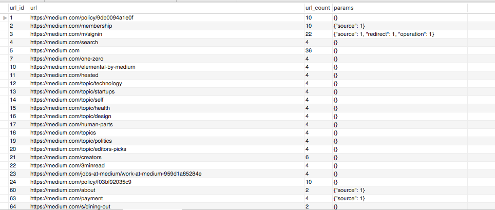

# recursive-web-crawler

###  Prerequisite

1. Install [Mysql 8.0.3 or later](https://dev.mysql.com/doc/refman/8.0/en/installing.html) as JSON_MERGE_PATCH()
has support after that
2. Install [Node.js and npm](https://docs.npmjs.com/downloading-and-installing-node-js-and-npm)

### How to Run the project

1. Clone the project ` git clone https://github.com/siddharthanarang/recursive-web-crawler.git `
2. Install the node modules with `npm install`
3. Create the Mysql schema with the query present in ` ./databases/mysql/schema.sql `
4. Finally Run the command.
    ```
    NODE_ENV=dev node app.js
    ```
### Functioning
1. It starts from app.js `appStartup()` function which initializes mysql connection and calls `initiateCrawling()` function.
2. It pushes the Base Url in the ***crawlingQueue*** which stores all the url that need to be crawled.
3. There are few variables and constants parameter that control crawling :

 ```
 #### Constants

 baseUrl = Contains Base Url of the website, like https://medium.com
 maxCrawlingConcurrentRequests = No of concurrent request at a particular time.
 maxRequests =  No of Maximum Request we will be hitting to the baseUrl after that stop crawling.

#### Variables

crawlingQueue (Array) = Queue which has all the Url which need to be crawled
stopCrawling (Boolean) = Variable to stop the crawling when maxRequests Limit is reached
totalHits =  Maintaining a record of no of total hits we have consumed
currentHits = Maintaining a record of no of concurrent hits at a particular time

 ```
 4. Crawling process will keep on working continuously (Hit webPages Concurrently within limits so that we don't
 get blocked ) with checking condition whether that has been crawled already or not,
 recursively till the time maxRequests limit is reached.

 5. Once webPage is requested all the internal (links which has relative path of the base url like /topic/health)
 as well as external(links which has absolute path of the base url like https://medium.com/3minread) links are extracted.

 6. These link are further divided into url and params and stored in mysql depending on if url already exist or
 first time inserted along with count of that url and params using ***DUPLICATE KEY*** property on ***URL***.

 7. It also pushes unique links in ***crawlingQueue*** which can be further picked by the crawler to request that
 URL and extract links when that particular URL turn comes.

### Output
- Every unique URL you encountered -> ***Stored in url column***
- The total reference count of every URL -> ***Stored in url_count column***
- A complete unique list of parameters associated with this URL -> ***Stored in params column***



### Enhancement
- Instead of taking local variables of crawlingQueue and extractedLinks we can store that data in Redis so that if program
stops or is restarted it can continue from where it left.
